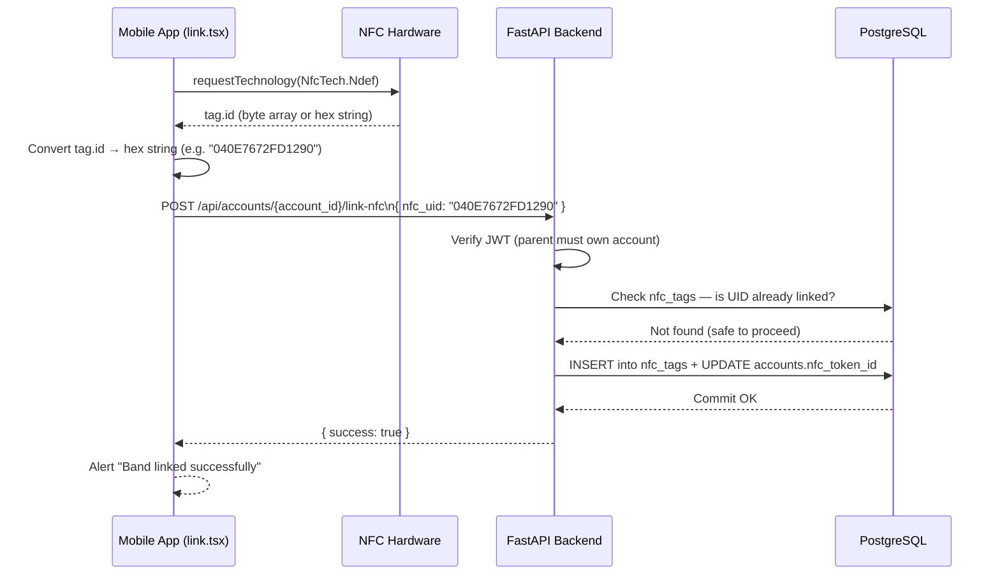

# NFC Wristband Linking — How It Works

## Overview

When a parent links a child's NFC wristband to their account, the app reads the physical tag's unique hardware ID (UID) and permanently associates it with the child's wallet in the database. From that point, the wristband acts as the child's payment credential at a POS terminal.

---

## End-to-End Flow



---

## Component Breakdown

### 1. Mobile App — [link.tsx](file:///c:/Users/howar/NFC/NFC-App/mobile-app/app/%28tabs%29/link.tsx)

| Step | Action |
|------|--------|
| User taps **Connect** | `NfcManager.start()` initialises the NFC module |
| Checks support | `isSupported()` + `isEnabled()` — errors out early if NFC is off |
| Scans band | `requestTechnology(NfcTech.Ndef)` opens the system NFC sheet and waits for a tag |
| Reads UID | `getTag()` returns the tag object; `tag.id` is the hardware UID |
| Normalises UID | Byte arrays are converted to uppercase hex: `[4, 14, 118, ...]` → `"040E7672FD1290"` |
| Sends to API | `POST /api/accounts/{id}/link-nfc` with `{ nfc_uid }` in the body |

### 2. Backend API — `POST /api/accounts/{account_id}/link-nfc`

| Step | Action |
|------|--------|
| Auth check | JWT verified via `get_current_user` — must be a logged-in parent |
| Ownership check | Confirms the account belongs to one of the parent's children |
| Duplicate check | Queries `nfc_tags` — rejects if UID is already registered |
| Writes `nfc_tags` | Creates a new row with `nfc_uid`, `user_id`, `status = 'active'`, and a label |
| Updates `accounts` | Sets `accounts.nfc_token_id = nfc_uid` for fast POS lookups |
| Returns | `{ success: true, message: "Wristband linked successfully" }` |

### 3. Database — Two tables updated

**`nfc_tags`** — The canonical registry of all physical wristbands
| Column | Example |
|--------|---------|
| [id](file:///c:/Users/howar/NFC/NFC-App/mobile-app/context/FamilyContext.tsx#29-88) | UUID (auto-generated) |
| `nfc_uid` | `040E7672FD1290` |
| `user_id` | Child's `user_id` |
| `status` | `active` |
| `label` | `howie's Wristband` |

**`accounts`** — The child's wallet
| Column | Example |
|--------|---------|
| `nfc_token_id` | `040E7672FD1290` (unique) |

> [!NOTE]
> `accounts.nfc_token_id` has a `UNIQUE` index so POS terminals can do an instant single-lookup when a child taps their wristband to pay.

---

## Security Considerations

- **JWT required** — only an authenticated parent can call the link endpoint
- **Ownership checked** — the parent must own the child whose account is being linked (prevents cross-family linking)
- **Duplicate UID rejected** — a wristband already linked to anyone returns HTTP 400
- **UID never trusted from client at payment time** — the POS terminal sends the UID it reads, and the backend looks up the account; the client cannot impersonate a band

---

## Verified DB State (2026-03-15)

```
 nfc_uid         | status | label              | created_at
-----------------+--------+--------------------+----------------------------
 04117672FD1290  | active | howie's Wristband  | 2026-03-15 14:47:35
 04127672FD1290  | active | howie's Wristband  | 2026-03-15 14:47:18
 040E7672FD1290  | active | howie's Wristband  | 2026-03-15 14:46:59
```
